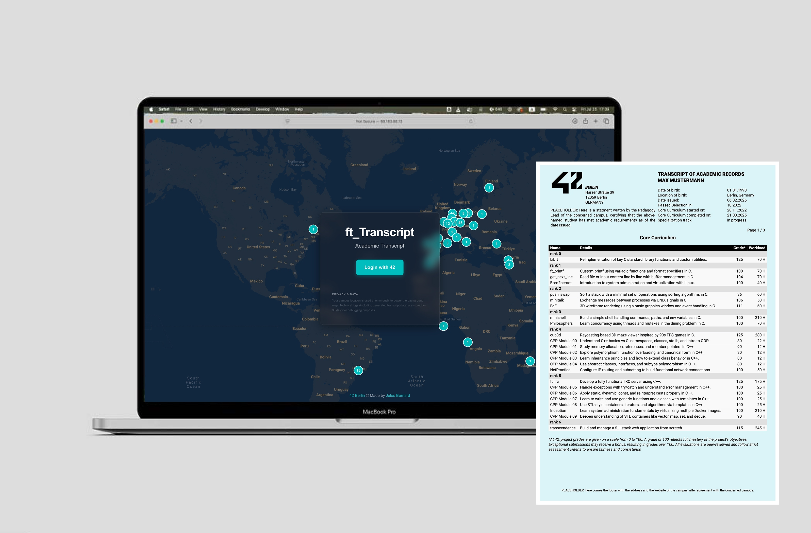

# 42 Transcript Generator

A web-based tool developed in collaboration with the **Pedago team at 42 Berlin** to generate **official academic transcripts** for 42 students. This service was created to fill the gap where a formal transcript did not previously exist, helping students present their achievements to employers, universities, and other institutions upon request.



🔗 **Live Demo**: [transcript42.project-cloud.cloud](https://transcript42.project-cloud.cloud)

---

## ✨ Features

- 🔐 **OAuth2 Authentication** via the 42 API  
- 📄 **PDF Transcript Generation** in **English** or **German**
- 🎓 Option to generate:
  - Only the **core curriculum**
  - Core curriculum + **specialization track** (for advanced students)
- 🗺️ **Interactive Map** showing global usage statistics across 30+ campuses
- 📊 **Usage Analytics** with Supabase backend
- 🚀 **GitHub Actions CI/CD** for automated deployment
- 📦 **Dockerized** for reproducible builds and easy deployment

---

## 🧠 Tech Stack

| Technology         | Role                                        |
|--------------------|---------------------------------------------|
| **Next.js 16**     | Full-stack Web Framework (App Router)       |
| **React 19**       | UI Components                               |
| **TypeScript**     | Static typing & developer experience        |
| **pdfmake**        | Server-side PDF generation                  |
| **Zod**            | Runtime schema validation                   |
| **Supabase**       | Database, storage & logging                 |
| **Google Maps API**| Interactive background visualizations       |
| **Docker**         | Containerization                            |
| **42 API**         | Student data integration (OAuth + fetch)    |
| **GitHub Actions** | CI/CD pipeline                              |

---

## 🏗️ Project Structure

```
transcript42/
├── app/
│   ├── actions/           # Server actions
│   │   ├── generatePDF/   # PDF generation logic
│   │   │   ├── components/   # PDF layout components
│   │   │   ├── lib/          # Utilities (header-formatter, process-data)
│   │   │   ├── data/         # Project definitions (JSON)
│   │   │   └── styles/       # PDF styling
│   │   ├── audit.ts       # Usage tracking & logging
│   │   └── fetchPDF.ts    # Main PDF fetching action
│   ├── api/               # API routes (OAuth callback)
│   ├── components/        # React UI components
│   ├── lib/               # Shared utilities (42 API, session)
│   └── types/             # TypeScript type definitions (Zod schemas)
├── db/                    # Supabase SQL setup
├── assets/                # Fonts and logos
└── lib/                   # Server utilities (logger, supabase client)
```

---

## 🔧 API Routes

| Endpoint               | Method | Description                                      |
|------------------------|--------|--------------------------------------------------|
| `/`                    | GET    | Landing page with login overlay                  |
| `/api/oauth/callback`  | GET    | Handles the 42 OAuth redirect and token exchange |
| `/transcriptForm`      | GET    | Form page for generating transcripts             |

---

## 📄 Transcript Contents

Generated transcripts include:
- Student name and birth information
- Pool month/year and core curriculum dates
- Completed projects with grades
- Optional: specialization track (for advanced students)

Available in **German** or **English** formats.

---

## 🔐 Security

- **OAuth 2.0** ensures secure authentication via 42's API
- **Row Level Security (RLS)** enabled on all Supabase tables
- **Service role key** used only server-side for audit logging
- Environment variables properly gitignored

---

## 🌍 Campus Support

Currently fully supported:
- **42 Berlin** (logos, legal notes, and pedagogy statement)

Other campuses can use the tool, but will see placeholder content. To add your campus's official branding, please [open an issue](https://github.com/julesrb/Transcript42/issues/new) or contact me.

---

## 🧑‍💻 Contributing

Contributions are welcome! Feel free to:
- Open a [pull request](https://github.com/julesrb/Transcript42/pulls)
- Report bugs via [issues](https://github.com/julesrb/Transcript42/issues)
- Suggest new features

---

## 📝 License

This project is maintained by [@julesrb](https://github.com/julesrb) in collaboration with 42 Berlin.
